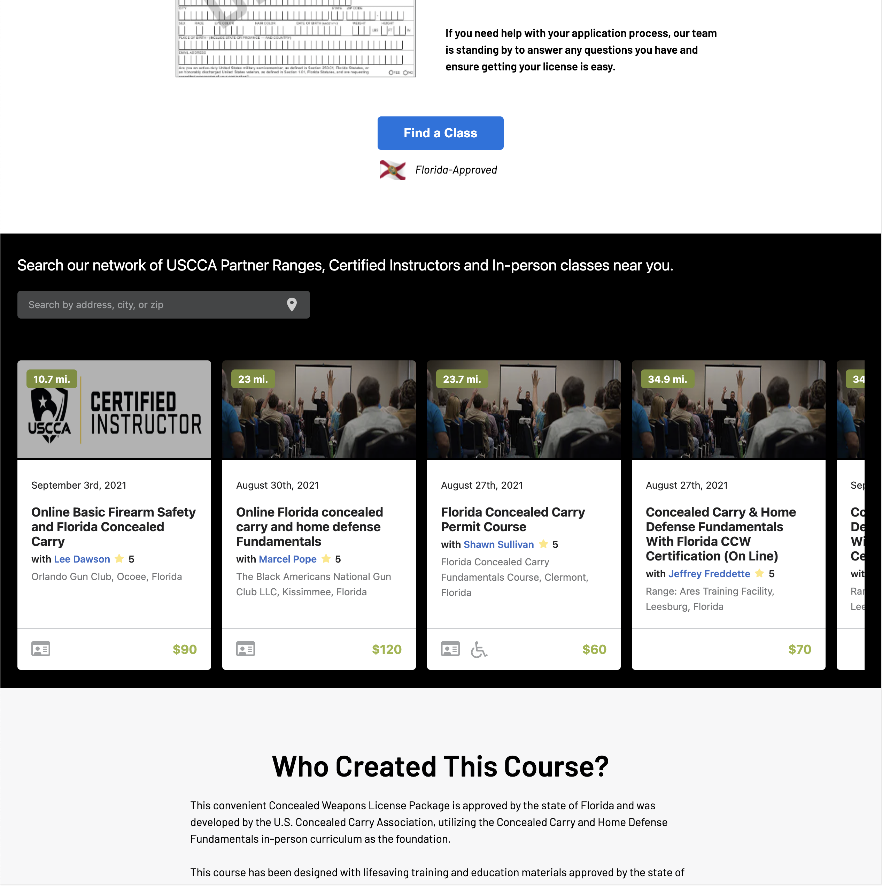

# [Embeddable iFrame](https://iframe-next-js.vercel.app/)

An embeddable iFrame developed for curriculum, organizations, and instructors to utilize on their webpages.



### Overview

- `pages/iframe/[type]/[id]`: This is a dynamic route filtering on an Algolia indices. 
  -  `[type]` corresponds to `curriculum`, `organization`, or `instructor` 
  - `[id]` is the respective Algolia filter.

### Running Locally

```
$ git clone git@github.com:jakequinter/iframe.git
$ cd iframe.js
```

#### yarn

```
$ yarn
$ yarn dev
```

#### npm

```
$ npm install
$ npm run dev
```

Create a `.env.local` file similar to what is posted below:

```
NEXT_PUBLIC_TRAINING_URL=
NEXT_PUBLIC_ALGOLIA_APP_ID=
NEXT_PUBLIC_ALGOLIA_SEARCH_API_KEY=
NEXT_PUBLIC_ALGOLIA_PLACES_APP_ID=
NEXT_PUBLIC_ALGOLIA_PLACES_PUBLIC_KEY=
NEXT_PUBLIC_ALGOLIA_OCCURRENCES_INDEX=
```

### Built With

- [Vercel](https://vercel.com/)
- [Next.js](https://nextjs.org/)
- [Algolia](https://www.algolia.com/)
- [Sass](https://sass-lang.com/)

### View in Production

- [FL-CCHDF](https://www.usconcealedcarry.com/uscca-info/product/florida-license-to-carry-course/)
- [TX-CCHDF](https://www.usconcealedcarry.com/uscca-info/product/texas-license-to-carry-course/)
